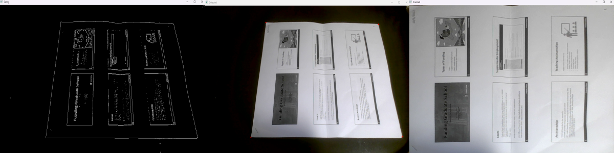

# File Scanning with OpenCV
This is a mini-project I implemented with OpenCV, aimed to reproduce similar functions of most file scanning applications on our phones. Given a file sitting on the desk, the program should automatically detect whether there is a file and determine its precise position. Finally, return the picture of the file in bird's-eye view.

## Results
The following three images are detected canny edges, detected contours (with four red dots), and the scanned file corresponding from left to right.

